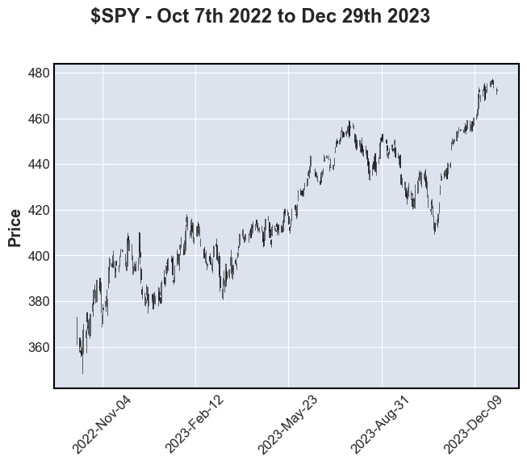
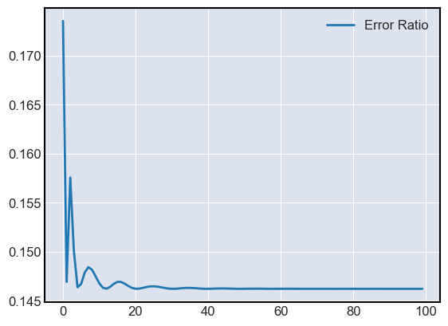

# Welcome to $SPY Predictor! 🕵️
Using a Long Short-Term Memory (LSTM) Neural Network to find correlation for the $SPY ETF over time!

## Charts
First collected historical data on daily $SPY prices from https://finance.yahoo.com/quote/SPY/history. I collected data from January 29th, 1993, to March 8th, 2024.

Trained the model with data from October 7th, 2022, to December 29th, 2023.

The data is trained over 100 epochs making the error ratio (wrong predictions to total predictions) lower.

## Background
A *Neural Network* is an intricate series of equations that transforms data (numbers). Data is linearly transformed and then non-linearly transformed at *activation nodes*. The input data point is fed forward through one or more *layers* to generate a prediction output. The prediction output is compared with the actual output to compute the error.

*Backwards propagation* is when the network updates the weights and biases used for linear transformation of data. This is done by setting the error gradients as close to 0 as possible.

The whole thing gets updated after every input training data.

A *Recurrent Neural Network* (*RNN*), extends a regular *Neural Network* by transforming data within a layer several times. It is used to work with temporal (time-based) data, because present values depend on the past.

The *LSTM Neural Network* is an *RNN* that uses long-lived and short-lived values during the training process. It is particularly designed to address the pitfalls of regular *RNN*'s.

## Note
This has been trained on bull market conditions, and so won't fare well
in a bear market.

Obviously not super complex, but fun to work on.

## Inspired by
https://www.kaggle.com/code/taronzakaryan/predicting-stock-price-using-lstm-model-pytorch/notebook
