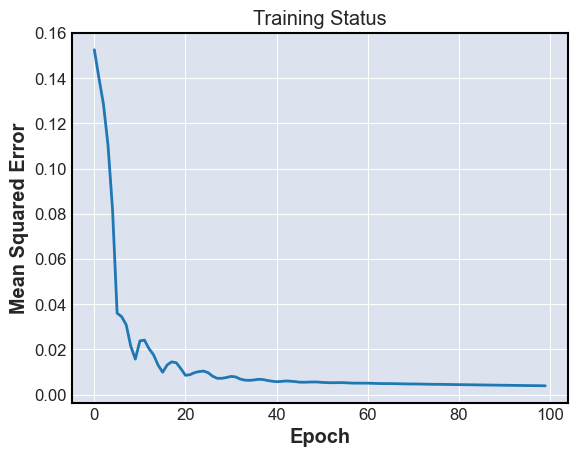

# $SPY Predictor 🕵️
Uncovering correlation within the $SPY ETF using a Long Short-Term Memory (LSTM) Neural Network in PyTorch. Knowing 60 days of consecutive $SPY close prices allows me to predict the 61st day's close price with 78.05% accuracy*

*Note: Only for 1/2/2024 - 3/1/2024 and allowing for 1% discrepancy

## Charts
Collected historical data on daily $SPY prices from https://finance.yahoo.com/quote/SPY/history. Data is from January 29th, 1993, to March 8th, 2024.

Trained the model with closing prices from October 7th, 2022, to December 29th, 2023.\

Visual of the training process.\

Using the finished model to predict prices.\

## Inspiration
https://www.kaggle.com/code/taronzakaryan/predicting-stock-price-using-lstm-model-pytorch/notebook
